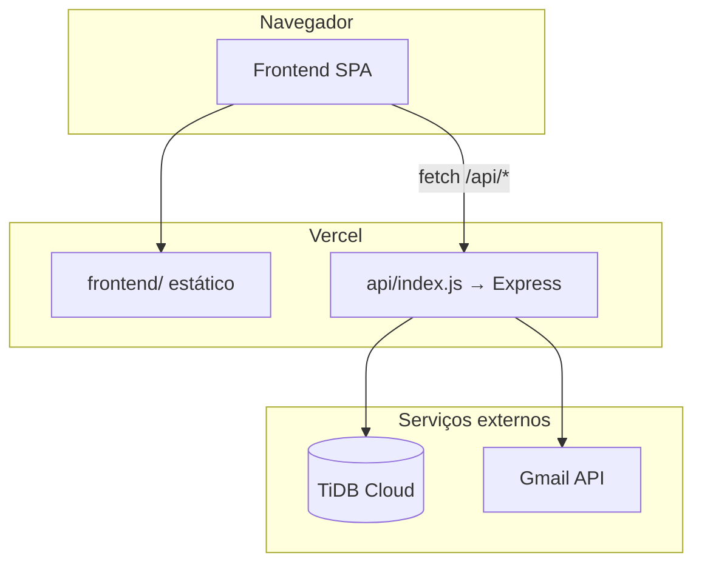
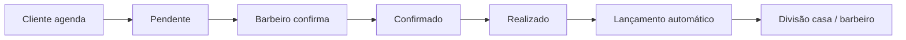

# Barbearia Castilho — Sistema de Gestão

Plataforma web completa para barbearias: agendamento online, painel do barbeiro, controle administrativo, módulo financeiro com divisão de lucros e notificações por e-mail. O projeto serve como **base reutilizável** — clone, personalize marca, serviços e comissões para outras barbearias sem reescrever a arquitetura.

**Produção:** [barbearia-castilho.vercel.app](https://barbearia-castilho.vercel.app/)

---

## Como funciona

A aplicação é uma **SPA vanilla** (HTML + CSS + JavaScript) que conversa com uma **API REST em Node.js/Express**. O banco **TiDB Cloud** (MySQL compatível) guarda usuários, agendamentos e lançamentos financeiros. O deploy no **Vercel** serve o frontend como arquivos estáticos e a API como função serverless.



### Perfis de acesso

| Perfil | O que faz |
|--------|-----------|
| **Cliente** | Cadastro, agendamento (serviço, data, horário, barbeiro), acompanhamento de status, toast quando o corte é confirmado |
| **Barbeiro** | Agenda do dia, confirmar presença, marcar atendimento como realizado |
| **Administrador** | Barbeiros, serviços, expediente, agenda geral, financeiro, comissões e estatísticas |

### Fluxo de agendamento e financeiro



Ao concluir um atendimento, o sistema grava valor e comissão com **snapshots** (preço e percentual no momento do agendamento), mantendo relatórios consistentes mesmo se preços ou comissões mudarem depois.

### Fluxo de recuperação de senha

1. Cliente informa o e-mail em **Esqueci minha senha**
2. API gera código de 6 dígitos e salva hash em `password_reset_tokens`
3. **Gmail API** envia o código por e-mail
4. Cliente digita código + nova senha na tela (passo 2)
5. API valida token e atualiza a senha

---

## Stack tecnológica

| Camada | Tecnologia | Função |
|--------|------------|--------|
| **Frontend** | HTML5, CSS3, JavaScript ES Modules | Interface responsiva, sem framework — leve e fácil de customizar |
| **Backend** | Node.js 18+, Express 4 | API REST, JWT, regras de negócio |
| **Banco** | TiDB Cloud (MySQL) | Dados transacionais com conexão SSL |
| **Autenticação** | JWT + bcrypt | Sessões stateless; senhas hasheadas |
| **E-mail** | Gmail API + OAuth2 (`googleapis`) | Transacionais: recuperação, confirmação, avisos |
| **Deploy** | Vercel | Static frontend + serverless Node (`vercel.json`) |

### Dependências principais

`express`, `mysql2`, `jsonwebtoken`, `bcryptjs`, `googleapis`, `uuid`, `dotenv`, `cors`

---

## Estrutura do projeto

```
├── api/
│   └── index.js                    # Entrada serverless no Vercel
├── backend/
│   ├── src/
│   │   ├── routes/                 # auth, appointments, admin, services, users
│   │   ├── services/               # financeiro, auditoria, estatísticas
│   │   ├── middleware/             # JWT
│   │   ├── config/                 # Pool TiDB
│   │   └── utils/
│   │       ├── notifications.js    # Templates HTML dos e-mails
│   │       └── gmail-client.js     # Cliente Gmail API (OAuth2)
│   ├── scripts/
│   │   ├── gmail-get-refresh-token.js
│   │   ├── gmail-exchange-code.js
│   │   └── test-gmail-send.js
│   ├── run-migrations.js
│   └── ca.pem                      # Certificado SSL TiDB (local)
├── database/
│   ├── schema.sql
│   └── migrations/                 # 002 a 006
├── frontend/
│   ├── index.html
│   ├── styles.css
│   └── js/                         # auth, customer, barber, admin, ui
├── vercel.json
├── .env.example
├── .env.gmail.example              # Modelo só das variáveis Gmail
└── package.json
```

---

## Módulos principais

### Backend

| Módulo | Responsabilidade |
|--------|------------------|
| `routes/auth.js` | Login, registro, forgot/reset password |
| `routes/appointments.js` | Reserva, disponibilidade, máquina de estados |
| `routes/admin.js` | Barbeiros, financeiro, estatísticas |
| `routes/services.js` | CRUD de serviços |
| `services/profit-service.js` | Lançamentos e divisão de lucros |
| `services/audit-service.js` | Log imutável de ações sensíveis |
| `utils/notifications.js` | Monta e dispara e-mails |
| `utils/gmail-client.js` | Envia via `gmail.users.messages.send` |

### Frontend

| Pasta | Responsabilidade |
|-------|------------------|
| `js/main.js` | Entrada, formulários globais |
| `js/auth/` | Welcome, login, registro, recuperação em 2 passos |
| `js/customer/` | Agendamento e lista de cortes |
| `js/barber/` | Dashboard do barbeiro |
| `js/admin/` | Painel administrativo modular |
| `js/api-client.js` | Cliente HTTP com JWT |

A interface muda conforme o **papel** (Cliente, Barbeiro, Admin) após o login, sem recarregar a página.

### Endpoints REST

| Prefixo | Exemplos |
|---------|----------|
| `/api/auth` | `POST /login`, `/register`, `/forgot-password`, `/reset-password` |
| `/api/appointments` | `POST /book`, `GET /availability`, `PUT /:id/status` |
| `/api/services` | `GET /`, `POST /`, `PUT /:id` |
| `/api/admin` | `GET /statistics`, `/profit-entries`, `POST /barbers` |
| `/api/user` | `PUT /password` |

---

## E-mail com Gmail API

O sistema **não usa SMTP nem templates do painel Google**. Os e-mails são HTML montado em código (`notifications.js`) e enviados pela **Gmail API** com OAuth2 refresh token.

### Arquivos envolvidos

| Arquivo | Papel |
|---------|--------|
| `backend/src/utils/gmail-client.js` | OAuth2 + envio MIME |
| `backend/src/utils/notifications.js` | Templates e tipos de e-mail |
| `.env.gmail` / `.env.gmail.example` | Variáveis Gmail isoladas (referência para o Vercel) |

### E-mails automáticos

| Evento | Gatilho |
|--------|---------|
| Conta criada | Após registro |
| Código de recuperação | Esqueci minha senha (6 dígitos) |
| Senha alterada | Reset ou troca no perfil |
| Corte confirmado | Barbeiro confirma agendamento |

### Configuração (Google Cloud)

1. Projeto em [Google Cloud Console](https://console.cloud.google.com/)
2. Ativar **Gmail API**
3. **OAuth consent screen** → External, escopo `https://www.googleapis.com/auth/gmail.send`
4. Adicionar **Test users** (e-mail remetente) enquanto o app estiver em Testing
5. Credencial **OAuth 2.0 Client ID** (Web application)
6. Redirect URI: `http://localhost:3333/oauth2callback`

### Variáveis de ambiente

```env
EMAIL_PROVIDER=gmail
EMAIL_FROM_NAME=Barbearia Castilho
EMAIL_FROM_ADDRESS=seu@gmail.com
GMAIL_CLIENT_ID=....apps.googleusercontent.com
GMAIL_CLIENT_SECRET=...
GMAIL_REFRESH_TOKEN=...
```

> `EMAIL_FROM_ADDRESS` deve ser **o mesmo Gmail** autorizado no OAuth.

Use `.env.gmail.example` como modelo. Copie para `.env.gmail` (gitignored) e depois para o painel do Vercel.

### Gerar refresh token (uma vez, no PC)

```bash
npm run gmail:auth
```

- Mantenha o terminal aberto
- Autorize no link do Google (não abra `localhost:3333` manualmente)
- Copie o `GMAIL_REFRESH_TOKEN` para `.env`, `.env.gmail` e **Vercel → Environment Variables**

Se o redirect falhar com conexão recusada, cole a URL completa do callback:

```bash
npm run gmail:exchange -- "http://localhost:3333/oauth2callback?code=..."
```

### Testar envio

```bash
# Via API de produção
node backend/scripts/test-gmail-send.js destino@gmail.com --production

# Endpoint interno (requer NOTIFICATION_TEST_API_KEY no Vercel)
POST /api/auth/notifications/test
Header: x-notification-test-key
Body: { "email": "...", "name": "..." }
```

---

## Banco de dados

Schema base: `database/schema.sql`. Migrations incrementais em `database/migrations/`:

| Migration | Conteúdo |
|-----------|----------|
| `002` | `financial_audit_log` |
| `003` | Soft delete (`users.deleted_at`) |
| `004` | Snapshots financeiros nos agendamentos |
| `005` | Limpeza de locks órfãos |
| `006` | `password_reset_tokens` (recuperação de senha) |

**Tabelas centrais:** `users`, `services`, `appointments`, `profit_entries`, `barber_working_hours`, `password_reset_tokens`, `financial_audit_log`.

```bash
node backend/run-migrations.js
```

> Após o `schema.sql`, rode as migrations. A `006` é **obrigatória** para recuperação de senha funcionar.

---

## Configuração local

### Pré-requisitos

- Node.js 18+
- TiDB Cloud (ou MySQL 8+ com SSL)
- Certificado `backend/ca.pem`
- Credenciais Gmail OAuth (para e-mail)

### Passo a passo

```bash
git clone <url-do-repositorio>
cd barbearia
npm install
cp .env.example .env
# Preencha DATABASE_*, JWT_SECRET e variáveis Gmail
cp .env.gmail.example .env.gmail
# Preencha GMAIL_* e rode npm run gmail:auth
```

1. Execute `database/schema.sql` no TiDB
2. Rode `node backend/run-migrations.js`
3. Inicie: `npm start` → `http://localhost:5000`
4. Checklist Vercel: `npm run vercel:env-check`

> **Primeiro administrador:** criado via `schema.sql` ou painel após deploy. **Não commite credenciais** — altere a senha padrão imediatamente após o primeiro acesso.

---

## Deploy no Vercel

O `vercel.json` define:

- `/api/*` → `api/index.js` (Express serverless)
- assets (`.js`, `.css`, imagens) → `frontend/`
- demais rotas → `frontend/index.html` (SPA)

### Variáveis obrigatórias (Production)

| Variável | Descrição |
|----------|-----------|
| `DATABASE_HOST`, `DATABASE_PORT`, `DATABASE_NAME` | TiDB Cloud |
| `DATABASE_USER`, `DATABASE_PASSWORD` | Credenciais do cluster |
| `JWT_SECRET` | Chave longa e aleatória |
| `DATABASE_CA` | Conteúdo do `ca.pem` ou arquivo no deploy |
| `NODE_ENV` | `production` |

### Variáveis Gmail + app

| Variável | Descrição |
|----------|-----------|
| `EMAIL_PROVIDER` | `gmail` |
| `EMAIL_FROM_NAME`, `EMAIL_FROM_ADDRESS` | Remetente |
| `GMAIL_CLIENT_ID`, `GMAIL_CLIENT_SECRET`, `GMAIL_REFRESH_TOKEN` | OAuth2 |
| `FRONTEND_URL`, `CORS_ORIGIN` | URL pública (ex.: `https://barbearia-castilho.vercel.app`) |
| `NOTIFICATION_TEST_API_KEY` | Opcional — testes de e-mail via API |

O `.env` local **não sobe** automaticamente. Cadastre tudo no painel e faça **Redeploy**.

### TiDB Cloud — rede

Libere acesso público ou IPs do Vercel em **Network Access**, senão a API não conecta ao banco.

### Deploy

```bash
npx vercel --prod
```

Ou push na branch conectada ao Git — deploy automático.

---

## Personalizar para outra barbearia

| O que mudar | Onde |
|-------------|------|
| Nome, logo, endereço | `frontend/index.html`, `styles.css`, `logo.png` |
| Cores | Variáveis CSS em `styles.css` |
| Textos dos e-mails | `backend/src/utils/notifications.js` |
| Remetente Gmail | `.env.gmail` / Vercel |
| Serviços iniciais | `schema.sql` ou painel admin |
| URL pública | `FRONTEND_URL`, domínio customizado no Vercel |

---

## Scripts

| Comando | Descrição |
|---------|-----------|
| `npm start` | API na porta 5000 |
| `npm run dev` | Frontend estático (8080) |
| `npm run vercel:env-check` | Checklist de variáveis |
| `npm run gmail:auth` | Gera `GMAIL_REFRESH_TOKEN` |
| `npm run gmail:exchange -- "URL"` | Troca código OAuth manualmente |
| `node backend/run-migrations.js` | Aplica migrations |
| `node backend/scripts/test-gmail-send.js email --production` | Teste de e-mail |

---

## Segurança

- Nunca commite `.env`, `.env.gmail`, senhas ou tokens
- Rotacione credenciais expostas (banco, Gmail, JWT)
- Use `FRONTEND_URL` / `CORS_ORIGIN` com a URL exata em produção
- `financial_audit_log` registra alterações sensíveis no financeiro
- OAuth Google em modo Testing: limite a **Test users** ou publique o app

---

## Suporte rápido

| Problema | O que verificar |
|----------|-----------------|
| Welcome não responde | Console F12 — erros de JS |
| `Database error` na recuperação | Migration `006` aplicada? |
| E-mail não chega | Variáveis `GMAIL_*` no Vercel + redeploy |
| `403 access_denied` (Google) | E-mail em Test users no OAuth |
| `ERR_CONNECTION_REFUSED` no OAuth | Terminal do `gmail:auth` aberto durante autorização |
| API 500 | Logs Vercel + `DATABASE_*` + `JWT_SECRET` |

```bash
npm run vercel:env-check
```

---

## Licença

Defina a licença do seu fork (MIT, proprietária, etc.) conforme uso comercial ou revenda do template.
